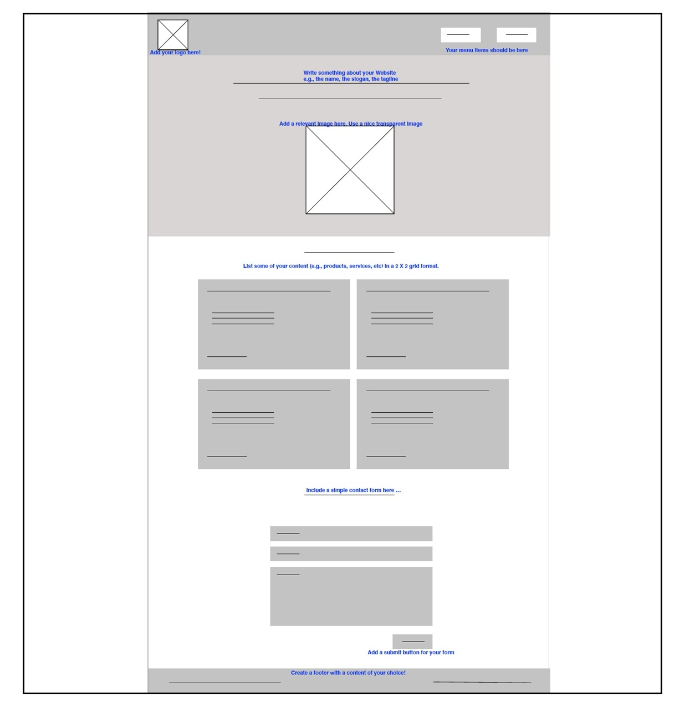

## Part 1: Setup
First, you'll need to take a copy of your finalized Assignment 1 and include it in your Assignment 2 repository. The easiest way to do this is to get this repository from GitHub Classroom and copy/paste your Assignment 1 files into the newly created space. Once everything is copied over, commit the files. This serves as your baseline moving forward.

## Part 2: Website Redesign
Feel free to relax the CSS requirements from the previous assignment and come up with a design of your choice. For the layout of the pages, you should follow the given layouts. Sample sketches are given in this document for small, medium, and large screens. You are expected to adjust the layout of your website for different screen sizes. 

### Sketches
Your website should look like the following sketches in small, medium and large devices. Your break points for small, medium, and large devices should be at 590 px and 790 px.

On a small device, your page should have a 1 column format. The menu items can be shown vertically or you can use a hamburger menu component.

On medium devices, you will be using a 2x2 grid in the middle of your page.

On large devices, the content should be centered with a fixed size of 790 px. The remaining spaces on the side (mostly fluid design pattern) should have a plain color of your choice. 

**Note that these are simple sketches. Feel free to adjust the sizes and spaces in your design.**

